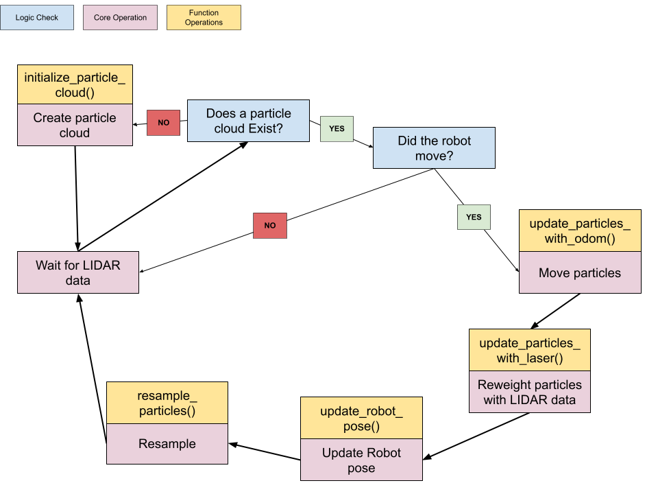

# Particle Filter Localization
CompRobo 2025 - Connor Hoang, Franklin Noble

### Overview
The goal of this project was to create a localization algorithm using only LIDAR and odometry, when provided an accurate map of the space, to determine a pose estimate of a robot's position.

To do this, we implemented a particle filter in C++ using ROS2 middleware. We were ultimately able to create a particle filter that converges reasonably well.

### Overall Code Structure
<!--(design decisions), system architecture-->
<!--Which files, explain c++...-->
Our primary particle filter logic is held in pf.cpp and the corresponding header file pf.hpp. We also have angle_helpers, helper_functions, and occupancy_field as files with functionality we use in pf.cpp related to their name.

Our code communicates with the robot and with visualization tools using ROS topics. The particle filter code itself is a ROS node, and it subscribes to the laser scan topic published by the robot. Whenever it updates the position estimate, it publishes that estimate to the transform `/tf` topic. It also publishes the particle cloud of pose guesses for debugging purposes. This topic, as well as the provided map, are displayed using the rviz2 ROS visualization tool. Rviz can also be used to publish an initial guess for the robot's position, so the convergence of the robot can be tested without needing large amounts of particles on larger maps. Separately, a teleoperation ROS node publishes move commands to the `/cmd_vel` topic, letting the robot drive around to gather more data about its environment. 
<!-- insert here figure of pubs and subs -->


Within pf.cpp, we had a class called ParticleFilter which contained the fundamental operations for the particle filter implementation. 

<!-- image of steps taken in run loop (the flow)-->

### Particle Filter Logic 
<!--appraoch-->
<!--Explain conceptual logic behind how a particle filter works-->
Shown in Figure 1 is the particle filter logic. The logic starts with the "wait for LIDAR data" block and repeats in the chain outlined by the diagram. 

<!-- block diagram of pf logic--> 

__Figure 1:__ Block diagram of particle filter logic. Logic chain starts at the "Wait for LIDAR data" block.

The algorithm start by waiting for LIDAR scan data as it is necessary for our ```update_particles_with_laser()``` function to work. When the scan is received, check if a particle cloud has been generated. If not, we generate one and wait for new data. Otherwise the program continues by checking if the robot moved enough for new data to be useful (scanning the same space repeatedly provides no additional information in our system). If the robot moved enough, we call update particles with odometry. This function allows for each particle to undergo the same change as the robot. 

Next, we reweigh by updating the particles with the laser data. For each particle, we project a vector from the particle's position at the angle corresponding to the robot's closest LIDAR measurement. This projection simulates what the particle would detect if it were the robot's true position. We then find the distance from this projected endpoint to the nearest obstacle on the map. If the particle is at the correct location with the correct orientation, this projected point should land inside an obstacle, leading to a value of 0. Hence, the code reweighs with a gaussian weighting function to reward smaller values of closest distance at the projected point.

Finally, the particle filter resamples particles to focus on areas of the map with greater likelihoods of the robot's presence. By replacing only 25% of the lowest weighted particles and distributing 20% of those particles proportionally to weights, convergence on the most likely areas is encouraged. The remaining 5% of particles being randomly generated provides a means to escape undesireable (inaccurate) local minima. All percentage values were tuned to an arbitrarily sufficient level.

#### Initialize Particles
initialize_particle_cloud(): Finds the bounding box of the map. Next, if given a pose estimate it randomly generates particles with normal distribution around that estimate. Otherwise, generates particles within map bounds with uniform randomness in valid locations until the desired number of particles is reached.
#### Update Particles with Odom
update_particles_with_odom(): This function finds the change in the robot's position since it was last updated. It then adds these changes in position to each particle as if each particle was the robot's position and orientation.  
#### Update Particles with laser (LIDAR)
update_particles_with_laser(): The function parses the LIDAR data to determine the closest distance and corresponding angle to an object. Then for each particle in the particle cloud, the function projects the true robot's closest distance out at the right angle. A helper function is called to get the closest distance from the projected point to an obstacle. As the ideal value would be in an object (and thereby zero), we proceed to weigh each particle such that the values closer to zero are more heavily weighted. Here is the math used to reweight each particle: $$exp(-(cd_proj * cd_proj) / (2.0 * sigma * sigma))$$.
#### Normalize Particles
normalize_particles(): This divides the weight of each particle by the total weight of all particles, so that all the weights add up to one.
#### Resample Particles
resample_particles(): Calls normalize_particles(). Sort the particles in the particle cloud by weight and remove a set percentage of the lowest weighted particles (default 25%). Replace some percentage (default 20%) of the original particles as duplicates of the surviving particles with a normal distribution of random noise, where surviving particles with higher weights have proportionally more particles assigned to them. Generate the remaining particles randomly as a means to mitigate dangers of particle death. Calls check_particles_inbounds().
#### Calculate Pose
update_robot_pose(): The robot's pose is estimated by calculating the weighted average of all particles in the particle cloud. The final x and y coordinates are the weighted mean of the particles' positions. The final orientation (theta) is calculated and weighted with angle wrapping in mind. The resulting pose represents the most likely position and orientation of the robot.
#### Check inbounds
check_particles_inbounds(): If a particle in the particle cloud is outside the map bounds, generate a random particle to replace it.

<!-- image of steps taken in run loop if time-->

### Challenges and Takeaways
<!--Removed for being redundant from seperate presentation: One notable challenge has been adapting to C++, particularly in a ROS enviorment. We both had some previous experience with C++ in firmware or otherwise, but we came into this project unfamiliar with some of the more complex elements of the language, such as pointers and the abstraction techniques that ROS uses. Most of the learnings here were from syntax and fundamental knowledge of how C++ works, especially as opposed to Python.  -->

One major challenge we faced was converging the robot's predicted pose to the correct angle. Our inital weighing methods failed to incorporate any angle information, so while we were able to converge in the x, y plane the angle of the robot was effectively random. We first attempted to rectify this with assuming the direction the robot moved in was the robots forward heading, assuming a linear path. Setting aside the variety of unreliable situations and plethora of assumptions inherent to this approach, our particle filter did not update fast enough to properly approximate using linear motion. We ultimately decided to pivot and were able to incorporate angular information using the method explained in the Particle Filter Logic section, allowing for convergence.

Another challenge we faced was working with outside code we did not write. While relying on this code was incredibly useful, due to time contraints we were unable to fully understand every aspect of the provided code, and hence remained unconfident in modifying code, even when we encountered seemingly undesired behavior. As part of a workaround for this, we either made assumptions and verified them using vizualization or wrote code in our section that accounted for incorrect assumptions during runtime. 

The following is a grab bag of tools we utilized and improved our familiarity with: rqt, rviz2, gazebo, yaml files, grep, git, ROS2 (ROS parameters, nodes, etc...), and C++ (i.e. pointers, header files, etc...).


### Next Steps
In our current simulated setup, our particle filter converges on the correct location, albeit with accuracy and precision limitations. Future progress could explore tuning the different parameters available to us to find optimal values. It could also explore slightly different methods of weighting such as incorporating more directions of LIDAR data, or adding random noise to the odometry particle updates to account for imperfect odometry data.

While our choice to use C++ provided us with runtime optimization, our implementation still leaves a lot of room for speed improvements. Right now, the filtering steps run just fast enough to localize the robot in real time -- this is good enough for small maps like the one we used, but localization on larger maps would likely need more particles to avoid dangers like particle death. Speed optimizations would let us use more particles, more resampling, and potentially even additional methods of evaluating particle likelihoods.

### Additional Documentation
<!-- say where bag files are attached here-->


